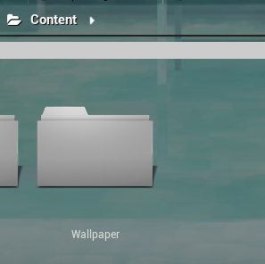

# WallpaperCustomTutorial
This plugin can change your UE background . make your engine colorful. \
In UE Marketplace for free just search WallpaperCustom to find it .it is very easy to use 
## Tutorial
### image
When you install plugin and open the project you will see a folder name of "Wallpaper" in your content \
And you can import your image to the folder and save \
 \
Then you can see the image list in here \
 
### WallpaperEngine
If you want to play video with Wallpaper Engine ,you just need go to EditorSetting -> General -> Wallpaper
then set you steam folder path \
 \
or you want to import you onwer video. \
you should create a new  /steamapps/workshop/content in your video library then move videos to this folder. baceuse the plugin will search this folder and import to play list\

For example : \
My video library is D:\Newfolder and create new folder in there. 
 \
then write path of D:/Newfolder to EditorSetting -> General -> Wallpaper -> Wallpaper Direction
