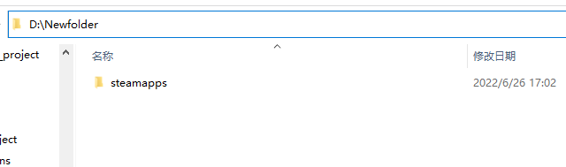

# WallpaperCustomTutorial
This plugin can change your UE background \
In UE Marketplace for free just search WallpaperCustom to find it \
it is very easy to use
## Tutorial
### image
Import your image to Wallpaper folder and save \
 \
Then you can see the image list in here \
 
### WallpaperEngine
If you want to play video with Wallpaper Engine ,you just need go to EditorSetting -> General -> Wallpaper
then set you steam folder path \
 \
or you want to import you onwer video. \
you should create a new  /steamapps/workshop/content in your video library. \
for example : My video library is D:\Newfolder and create new folder in there. 
 \
 \
then fill D:/Newfolder to EditorSetting -> General -> Wallpaper -> Wallpaper Direction
